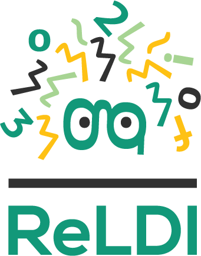
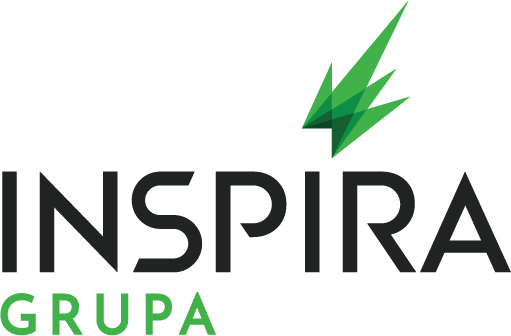

# Projekat COMtext.SR

**COMtext.SR** je projekat razvoja osnovnog skupa resursa i alata za automatsku obradu tekstova na srpskom jeziku, kako za ekavicu tako i za ijekavicu, koji će biti javno dostupni pod licencom koja omogućava njihovu upotrebu u bilo koje svrhe, uključujući komercijalne.

Fokus projekta je na domenima tekstova koji do sada nisu razmatrani bilo u akademskim bilo u komercijalnim javno dostupnim resursima i alatima za srpski jezik, kao što su pravno-administrativni, finansijski, medicinski, itd.

Sa tim ciljem na umu, ovaj projekat okuplja i sinhronizuje širu zajednicu (IT industrija, akademska zajednica) koja će doprineti realizaciji ovog zadatka kroz doniranje stručnih i materijalnih resursa i intelektualne svojine.

# Vizija

Vizija na kojoj je ovaj projekat zasnovan jeste otvaranje širokih mogućnosti za razvoj IT proizvoda baziranih na obradi i razumevanju prirodnih jezika (engl. *Natural Language Processing/Understanding - NLP/NLU*) – od brže integracije jezičkih alata u postojeće IT sisteme, preko stvaranja uslova za pokretanje startapa koji bi tržištu ponudili nova rešenja, do unapređivanja uslova za istraživanje i razvoj u domenu jezičkih tehnologija.

Želimo da buduće generacije budu u mogućnosti da uređajima oko sebe upravljaju koristeći srpski jezik, da kvalitetnije žive i efikasnije rade zahvaljujući moći računarske obrade i razumevanja prirodnog jezika.

# Metodologija

Najbolje rezultate u obradi prirodnih jezika trenutno postižu veliki jezički modeli (npr. BERT, GPT, i sl.), obučeni nad ogromnim količinama neobeleženih tekstova. Međutim, da bi se takvi modeli uspešno primenili na rešavanje konkretnih zadataka, njih je neophodno prilagoditi (engl. *fine-tuning*) uz pomoć manjih, posebno obeleženih skupova podataka specifičnih za zadatak i domen tekstova koji se razmatra. Projekat **COMtext.SR** je usmeren upravo na izradu namenskih, reprezentativnih i ekspertski proverenih označenih skupova podataka i njihovo korišćenje za izradu prilagođenih velikih jezičkih modela.

# Moduli

Projekat **COMtext.SR** je proistekao iz *Inicijative za otvorene NLP/NLU resurse srpskog jezika*, čiji su inicijatori obavili veliki broj sastanaka i konsultacija u okviru domaće IT zajednice, u kojima je učestvovalo preko 40 organizacija. Na osnovu obavljenih konsultacija, prioriteti za izradu NLP/NLU resursa za srpski jezik definisani su na sledeći način:

1. **Poboljšanje kvaliteta pretrage teksta** - ovaj modul ima za cilj poboljšanje osnovne pretrage tekstualnih podataka, što se postiže kroz razmatranje zadataka tokenizacije teksta, određivanja vrsta reči, lematizacije teksta i prepoznavanja imenovanih entiteta.

2. **Razumevanje teksta** - u sklopu ovog modula fokus je pre svega na razmatranju sledeća dva semantička zadatka:
* *Određivanje semantičke sličnosti* - predstavlja osnovnu komponentu svih sistema zasnovanih na razumevanju teksta, kao što su konverzacioni botovi i semantička pretraga.
* *Odgovaranje na pitanja* - predstavlja specifičniju komponentu konverzacionih botova.

3. **Izrada materijala za obuku NLP/NLU inženjera** - ovaj modul je namenjen popularizovanju resursa i alata razvijenih za obradu srpskog jezika i omogućavanju softverskim inženjerima da ih lakše koriste. 

# Dosadašnji rezultati

Projekat **COMtext.SR** je otpočeo sa fokusom na pravno-administrativni domen tekstova, kao domen koji je od zajedničkog interesa za najveći broj partnera projekta, kao i za ogroman broj državnih institucija i drugih organizacija.

## Anotirani podaci

U toku 2023. godine kreiran je prvi korpus pravno-administrativnih tekstova na srpskom koji je ručno anotiran u pogledu morfosintaktičkih odlika (po [Multext-East v6](http://nl.ijs.si/ME/V6/) standardu) i lema (osnovnih oblika reči). Izbor reprezentativnih pravnih tekstova različitog tipa (ugovori, presude, zaključci, rešenja, odluke, molbe, žalbe, pravilnici, zakoni, uredbe, statuti, zapisnici, itd.) koji su uključeni u korpus sproveden je uz pomoć advokatske kancelarije [Karanović & Partners](http://www.karanovicpartners.com). U korpus je uključeno 79 dokumenata, koji zajedno sadrže 4762 rečenice, odnosno 105470 tokena. Navedeni korpus je izrađen u paralelnim varijantama za oba izgovora srpskog jezika - ekavici i ijekavici.

U nastavku je dat pregled i poređenje novog COMtext.SR.legal korpusa sa sličnim prethodno izrađenim anotiranim korpusima srpskog jezika iz drugih domena:

| Korpus                                                      | Broj dokumenata | Broj rečenica | Broj tokena | Domen tekstova         | Izgovor srpskog jezika                            |
| ----------------------------------------------------------- | --------------- | ------------- | ----------- | ---------------------- | ------------------------------------------------- |
| [SETimes.SR 2.0](http://hdl.handle.net/11356/1843)          | 176             | 4384          | 97673       | novinski               | ekavica                                           |
| [ReLDI-NormTagNER-sr 3.0](http://hdl.handle.net/11356/1794) | 3748            | 6899          | 92271       | Twitter                | ekavica                                           |
| **COMtext.SR.legal**                                        | 79              | 4762          | 105470      | pravno-administrativni | ekavica i ijekavica, odvojene paralelne varijante |

**COMtext.SR.legal** anotirani korpus je dostupan za preuzimanje u connlu formatu:
- [**COMtext.SR.legal.ekavica.conllu**](https://github.com/ICEF-NLP/COMtext.SR/blob/main/data/comtext.sr.legal.ekavica.conllu)
- [**COMtext.SR.legal.ijekavica.conllu**](https://github.com/ICEF-NLP/COMtext.SR/blob/main/data/comtext.sr.legal.ijekavica.conllu)

Izvorni tekstovi dokumenata iz ovog korpusa, bez pratećih anotacija, takođe su dostupni na sledećem direktorijumu:
- [**COMtext.SR.legal.ekavica Plain Texts**](https://github.com/ICEF-NLP/COMtext.SR/blob/main/data/ekavica)
- [**COMtext.SR.legal.ijekavica Plain Texts**](https://github.com/ICEF-NLP/COMtext.SR/blob/main/data/ijekavica)

## Modeli

Uz pomoć izrađenog anotiranog korpusa, sprovedeno je prilagođavanje modela [BERTić](http://huggingface.co/classla/bcms-bertic) na zadatku morfosintaktičkog označavanja pravnih tekstova na srpskom. Tako dobijene varijante modela su dostupne na repozitorijumu HuggingFace:
- **[BERTić-COMtext-SR-legal-MSD-ekavica](http://huggingface.co/ICEF-NLP/bcms-bertic-comtext-sr-legal-msd-ekavica)**
- **[BERTić-COMtext-SR-legal-MSD-ijekavica](http://huggingface.co/ICEF-NLP/bcms-bertic-comtext-sr-legal-msd-ijekavica)**

Takođe su evaluirani i upoređeni različiti modeli i pristupi na zadacima morfosintaktičkog označavanja i lematizacije pravnih tekstova, pri čemu je lematizacija sprovođena uz pomoć prediktovanih morfosintaktičkih oznaka i flektivnih leksikona [srLex](http://hdl.handle.net/11356/1233) i [hrLex](http://hdl.handle.net/11356/1232). Korišćene metrike su tačnost (engl. *accuracy*, ACC) i [*Word Error Rate* (WER)](http://en.wikipedia.org/wiki/Word_error_rate). Pored različitih varijanti BERTića, razmotrena je i biblioteka [CLASSLA](http://pypi.org/project/classla/), kao i model [SrBERTa](http://huggingface.co/nemanjaPetrovic/SrBERTa), koji je posebno obučavan na pravnim tekstovima na srpskom jeziku. Prikazani rezultati velikih jezičkih modela su dobijeni nakon 15 epoha prilagođavanja. Ovaj repozitorijum sadrži sav programski kod korišćen u procesu prilagođavanja i evaluacije modela. Pored toga, dostupan je i [primer upotrebe ovih modela](https://github.com/ICEF-NLP/COMtext.SR/blob/main/examples/) u vidu Jupyter Notebook-a.

### Rezultati evaluacije - ekavica

| Pristup                                                       |  MSD ACC |   MSD WER  | Lemma ACC |  Lemma WER |
| ------------------------------------------------------------- | -------- | ---------- | --------- | ---------- |
| CLASSLA-SR (gold tokenizacija)                                |  0,9144  |   0,0856   |  0,9432   |   0,0568   |
| *CLASSLA-SR (CLASSLA tokenizator)*                            |     /    |  *0,0983*  |     /     |  *0,0739*  |
| BERTić prilagođen na SETimes.SR (gold tokenizacija)           |  0,9231  |   0,0768   |  0,9649   |   0,0351   |
| *BERTić prilagođen na SETimes.SR (CLASSLA tokenizator)*       |     /    |  *0,0884*  |     /     |  *0,0542*  |
| BERTić prilagođen na COMtext.SR.legal (gold tokenizacija)     |**0,9674**| **0,0326** |**0,9666** | **0,0334** |
| *BERTić prilagođen na COMtext.SR.legal (CLASSLA tokenizator)* |     /    |***0,0447***|     /     |***0,0526***|
| SrBERTa prilagođena na COMtext.SR.legal (gold tokenizacija)   |  0,9288  |   0,0712   |  0,9391   |   0,0609   |
|*SrBERTa prilagođena na COMtext.SR.legal (CLASSLA tokenizator)*|     /    |  *0,0851*  |     /     |  *0,0819*  |

### Rezultati evaluacije - ijekavica

| Pristup                                                       |  MSD ACC |   MSD WER  | Lemma ACC |  Lemma WER |
| ------------------------------------------------------------- | -------- | ---------- | --------- | ---------- |
| CLASSLA-SR (gold tokenizacija)                                |  0,9150  |   0,0850   |  0,9036   |   0,0964   |
| *CLASSLA-SR (CLASSLA tokenizator)*                            |     /    |  *0,0977*  |     /     |  *0,1135*  |
| CLASSLA-HR (gold tokenizacija)                                |  0,9062  |   0,0938   |  0,9353   |   0,0647   |
| *CLASSLA-HR (CLASSLA tokenizator)*                            |     /    |  *0,1076*  |     /     |  *0,0827*  |
| BERTić prilagođen na SETimes.SR (gold tokenizacija)           |  0,9234  |   0,0766   |  0,9412   |   0,0588   |
| *BERTić prilagođen na SETimes.SR (CLASSLA tokenizator)*       |     /    |  *0,0883*  |     /     |  *0,0780*  |
| BERTić prilagođen na COMtext.SR.legal (gold tokenizacija)     |**0,9674**| **0,0326** |**0,9429** | **0,0571** |
| *BERTić prilagođen na COMtext.SR.legal (CLASSLA tokenizator)* |     /    |***0,0447***|     /     |***0,0763***|
| SrBERTa prilagođena na COMtext.SR.legal (gold tokenizacija)   |  0,9300  |   0,0700   |  0,9187   |   0,0813   |
|*SrBERTa prilagođena na COMtext.SR.legal (CLASSLA tokenizator)*|     /    |  *0,0840*  |     /     |  *0,1024*  |

## Licence

Svi skupovi podataka izrađeni u okviru projekta COMtext.SR su javno dostupni pod licencom [CC-BY 4.0 International](http://creativecommons.org/licenses/by/4.0/deed.sr-latn). Svi kreirani modeli su javno dostupni pod licencom [Apache 2.0](http://www.apache.org/licenses/LICENSE-2.0). Stoga se i podaci i modeli mogu slobodno koristiti za bilo koje svrhe, uključujući i komercijalne, uz navođenje informacija o njihovom autorstvu.

# Ko smo mi?
Projekat sprovodi konzorcijum sledećih institucija:

**[Inovacioni centar Elektrotehničkog fakulteta u Beogradu (ICEF)](https://www.ic.etf.bg.ac.rs/?lang=sr)** je u okviru projekta **COMtext.SR** odgovoran za uspostavljanje i održavanje okruženja za razvoj jezičkih resursa, selekciju i pripremu domenskih tekstova za računarsku obradu, implementiranje i objavljivanje NLP/NLU modela i alata.

**[ReLDI centar za jezičke podatke](https://reldi.spur.uzh.ch/hr-sr/)** je u okviru projekta **COMtext.SR** odgovoran za anotaciju tekstova uključenih u korpuse i ručnu evaluaciju kvaliteta predikcija NLP/NLU modela.

# Partneri projekta

Sledeće organizacije su podržale projekat **COMtext.SR**:

<table>
  <thead>
    <tr>
      <th>Sajt partnera</th>
      <th>Logo partnera</th>
    </tr>
  </thead>
  <tbody>
    <tr>
      <td>
<strong><a href="http://www.rnids.rs/">RNIDS</a></strong>
</td>
      <td></td>
    </tr>
    <tr>
      <td>
<strong><a href="http://www.fosserbia.org/">Fondacija za otvoreno društvo</a></strong>
</td>
      <td></td>
    </tr>
    <tr>
      <td>
<strong><a href="http://comtradeintegration.com/sr/">Comtrade System Integration</a></strong>
</td>
      <td></td>
    </tr>
    <tr>
      <td>
<strong><a href="http://www.sas.com/en_si/home.html">SAS</a></strong>
</td>
      <td></td>
    </tr>
    <tr>
      <td>
<strong><a href="http://inspiragrupa.com/">Inspira grupa</a></strong>
</td>
      <td>

</td>
    </tr>
    <tr>
      <td>
<strong><a href="http://www.karanovicpartners.com">Karanovic & Partners</a></strong>
</td>
      <td></td>
    </tr>
    <tr>
      <td>
<strong><a href="http://www.alfanum.co.rs">Alfanum</a></strong>
</td>
      <td></td>
    </tr>
    <tr>
      <td>
<strong><a href="https://www.ite.gov.rs/">Kancelarija za IT i eUpravu</a></strong>
</td>
      <td></td>
    </tr>
  </tbody>
</table>
